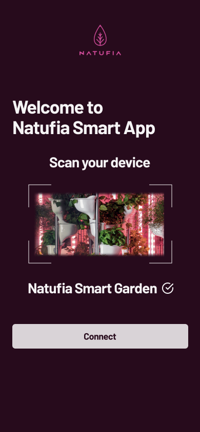
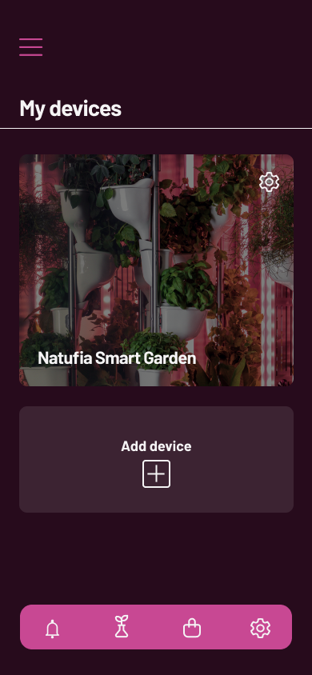
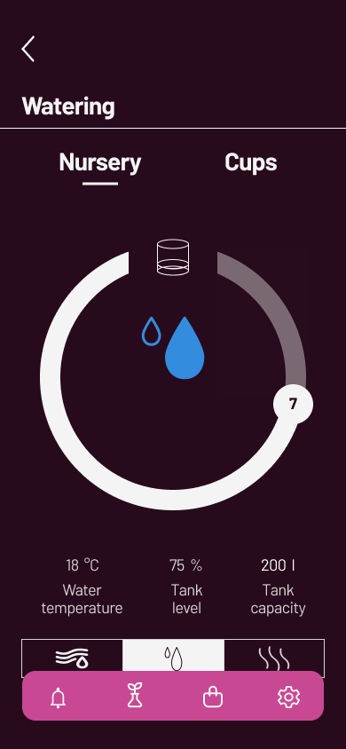
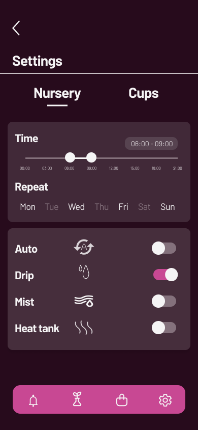
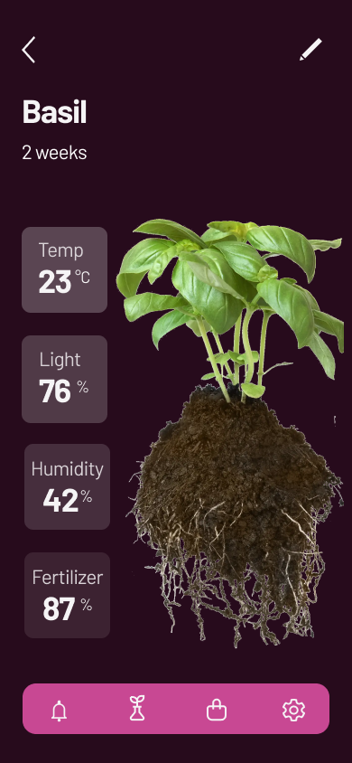

# Natufia Smart Garden Design

  
  
  
  
  

This repository contains the UI/UX design for the Natufia Smart Garden project, created using Figma. The design offers a user-friendly and modern interface tailored for managing and monitoring a smart garden.

Developed as part of the *User Interface Design* course at VERN' University, this project serves as both a showcase of modern design practices and a practical application of UI/UX principles.

## Project Structure
- `Natufia-Smart-Garden.fig`: The primary Figma design file, available in the root directory.
- `design-screens.pdf`: A PDF file showcasing the design screens, also located in the root directory.
- `gallery/`: Contains individual images of each screen design from the app.

## How to View the Design
- Download the `.fig` file from the repository.
- Open it in Figma to explore the complete design. The design screens can also be viewed in the included PDF file.
- Browse the `gallery/` folder to see individual screenshots of each screen design.
